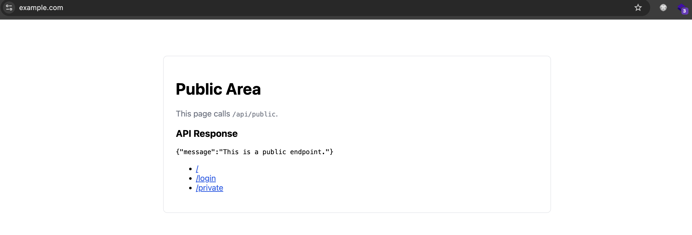

# Envoy Gateway Demo

A minimal example run behind Envoy Gateway showing features like TLS integration and external authorization.

## Repository Structure
- `apps/api/`: FastAPI service with a simple health endpoint
- `apps/web/`: Flask-based web frontend with login/private demo pages
- `helmchart/`: Helm chart to deploy the web and api apps and related Gateway resources
- `www.example.com.pem` / `www.example.com-key.pem`: Sample TLS certificate and key was made by mkcert

## Prerequisites
- Building images [Docker](https://docs.docker.com/engine/install/)
- Kubernetes cluster [Orbstack](https://orbstack.dev/) & [kubectl](https://kubernetes.io/docs/tasks/tools/)
- Chart deployment [Helm](https://helm.sh/docs/intro/install/#through-package-managers)

## Quick Start
1. Install demo CA cert on your laptop:
   - `mkcert -install`
2. Ensure the active Kubernetes cluster is the correct one:
   - `kubectl config current-context`
3. Install/upgrade the chart:
   - `helm upgrade --install envoy-gateway ./helmchart -f ./helmchart/values.yaml -n envoy-gateway`
4. Edit `/etc/hosts` and append `127.0.0.1 www.example.com api.example.com`.
5. Visit `https://www.example.com`.
